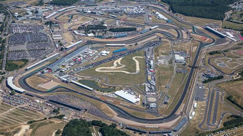
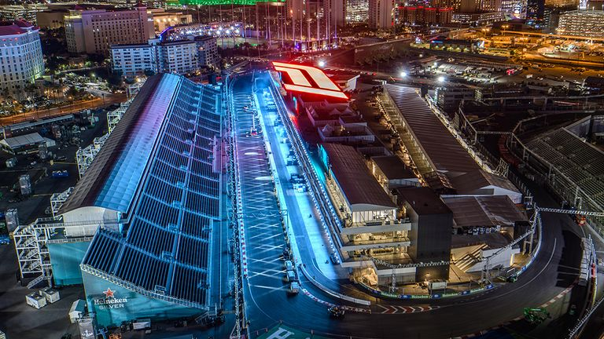
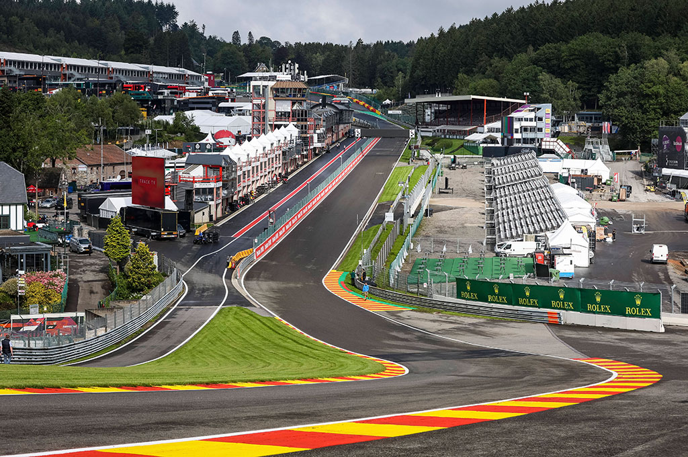
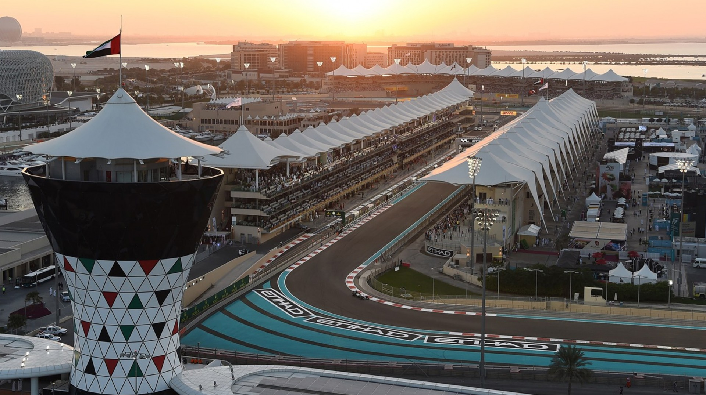

# Que es Formula 1

La Fórmula 1, conocida también como F1, es la categoría más prestigiosa del automovilismo de monoplazas y es organizada por la Federación Internacional del Automóvil (FIA). Se considera la cúspide de las carreras de autos debido a su combinación de tecnología avanzada, velocidad extrema y la participación de los mejores pilotos y equipos del mundo.

Los autos de Fórmula 1 son monoplazas diseñados específicamente para optimizar la velocidad y la eficiencia aerodinámica. Incorporan la tecnología más avanzada disponible, incluyendo motores de alto rendimiento, sofisticados sistemas electrónicos y materiales ligeros pero resistentes, como la fibra de carbono.

En la F1 compiten equipos de renombre mundial, como Mercedes, Ferrari y Red Bull, cada uno con sus propios pilotos de élite. Estos equipos invierten grandes recursos en investigación y desarrollo para obtener ventajas competitivas en cada carrera.

Actualmente esta compuesta por los equipos:

- Mercedes: Lewis Hamilton y George Russell.
- Red Bull: Max Verstappen y Sergio Pérez.
- Ferrari: Charles Leclerc y Carlos Sainz.
- McLaren: Lando Norris y Oscar Piastri.
- Alpine: Esteban Ocon y Pierre Gasly.
- Aston Martin: Fernando Alonso y Lance Stroll.
- AlphaTauri: Yuki Tsunoda y Daniel Ricciardo.
- Haas: Kevin Magnussen y Nico Hülkenberg.
- Williams: Alex Albon y Logan Sargeant.
- Stake F1 Team (anteriormente Sauber/Alfa Romeo): Valtteri Bottas y Zhou Guanyu.

## Circuitos

# Historia

La Fórmula 1 comenzó en 1950 con el primer campeonato mundial organizado por la FIA, siendo Giuseppe Farina el primer campeón. En las décadas de 1950 y 1960, fue dominada por pilotos y equipos europeos, como Juan Manuel Fangio y Ferrari. En los 1970s, la F1 se volvió más comercial y global, con pilotos como Niki Lauda y mejoras en la seguridad.

Los 1980s y 1990s vieron avances tecnológicos y rivalidades legendarias, como la de Ayrton Senna y Alain Prost. En el siglo XXI, se introdujeron regulaciones para mejorar la seguridad y sostenibilidad. Michael Schumacher y Lewis Hamilton se destacaron con siete campeonatos cada uno.

Hoy, la F1 sigue evolucionando con tecnologías híbridas y un enfoque en la sostenibilidad, manteniendo su popularidad global.

Algunos pilotos historicos son:

- Juan Manuel Fangio (Argentina) - Uno de los pilotos más exitosos de todos los tiempos, ganador de cinco campeonatos mundiales en la década de 1950.
- Ayrton Senna (Brasil) - Considerado por muchos como uno de los mejores pilotos de F1 de todos los tiempos, con tres campeonatos mundiales y un estilo de conducción agresivo y emocionante.
- Alain Prost (Francia) - Cuatro veces campeón del mundo y rival de Senna en una de las rivalidades más famosas de la historia de la F1.
- Michael Schumacher (Alemania) - Uno de los pilotos más dominantes en la historia de la F1, con siete campeonatos mundiales y numerosos récords de carrera.
- Niki Lauda (Austria) - Ganador de tres campeonatos mundiales y famoso por su increíble determinación y coraje, especialmente después de su accidente en 1976.
- Jackie Stewart (Reino Unido) - Triple campeón mundial conocido por su enfoque en la seguridad y su estilo suave pero rápido.
- Jim Clark (Reino Unido) - Dos veces campeón del mundo y considerado uno de los pilotos más talentosos y naturales que haya competido en la F1.
- Alberto Ascari (Italia) - Ganador de dos campeonatos mundiales consecutivos en la década de 1950 y conocido por su habilidad excepcional en condiciones de mojado.
- Emerson Fittipaldi (Brasil) - Ganador de dos campeonatos mundiales y conocido por ser el primer piloto brasileño en ganar el campeonato de Fórmula 1.
- Nigel Mansell (Reino Unido) - Campeón del mundo en 1992 y famoso por su estilo agresivo de conducción y su característico bigote.

# Como se gana

En la Fórmula 1, los pilotos ganan carreras al completar una serie de vueltas en un circuito más rápido que sus competidores. Cada carrera otorga puntos según la posición final de los pilotos, con el ganador recibiendo la mayor cantidad de puntos. Los puntos se acumulan a lo largo de la temporada en el Campeonato Mundial de Pilotos y el Campeonato Mundial de Constructores.

El piloto con más puntos al final de la temporada se corona Campeón Mundial de Pilotos, y el equipo con más puntos gana el Campeonato de Constructores. La estrategia, la habilidad del piloto, la eficiencia del equipo en paradas en boxes y la fiabilidad del auto son cruciales para el éxito en la F1.

# Campeonatos

En el mundo del automovilismo, la Fórmula 1 es la categoría más alta y prestigiosa, con dos campeonatos principales: el Campeonato Mundial de Pilotos y el Campeonato Mundial de Constructores. Los pilotos y equipos acumulan puntos a lo largo de la temporada en función de sus resultados en cada carrera, y los que tienen más puntos al final de la temporada se coronan campeones.

Además de la Fórmula 1, existen otras categorías importantes como la Fórmula 2 y la Fórmula 3, que sirven como plataformas de desarrollo para jóvenes pilotos. La Fórmula 2 es el escalón inmediato anterior a la F1, mientras que la Fórmula 3 es un nivel más bajo, orientado a pilotos aún más jóvenes. Ambas categorías tienen sus propios campeonatos y utilizan monoplazas estandarizados para resaltar el talento de los pilotos.

La Fórmula E es una categoría totalmente eléctrica que se centra en la sostenibilidad y la innovación en tecnología de vehículos eléctricos. Desde su inicio en 2014, ha crecido en popularidad y atrae a importantes fabricantes de automóviles. La Fórmula E celebra su propio campeonato mundial con carreras en circuitos urbanos en diversas ciudades del mundo, promoviendo tecnologías limpias en el automovilismo.

## Redes de los Pilotos

1. [Charles Leclerc](https://www.instagram.com/charles_leclerc/)
2. [Lewis Hamilton](https://www.instagram.com/lewishamilton/)
3. [Lando Norris](https://www.instagram.com/landonorris/)
4. [Max Verstappen](https://www.instagram.com/maxverstappen1/)
5. [Oscar Piastri](https://www.instagram.com/oscarpiastri/)
