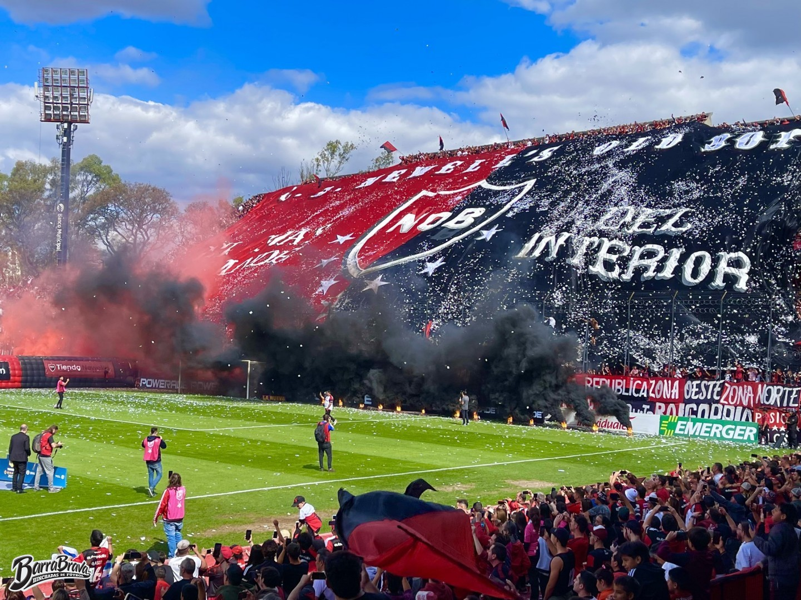
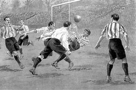
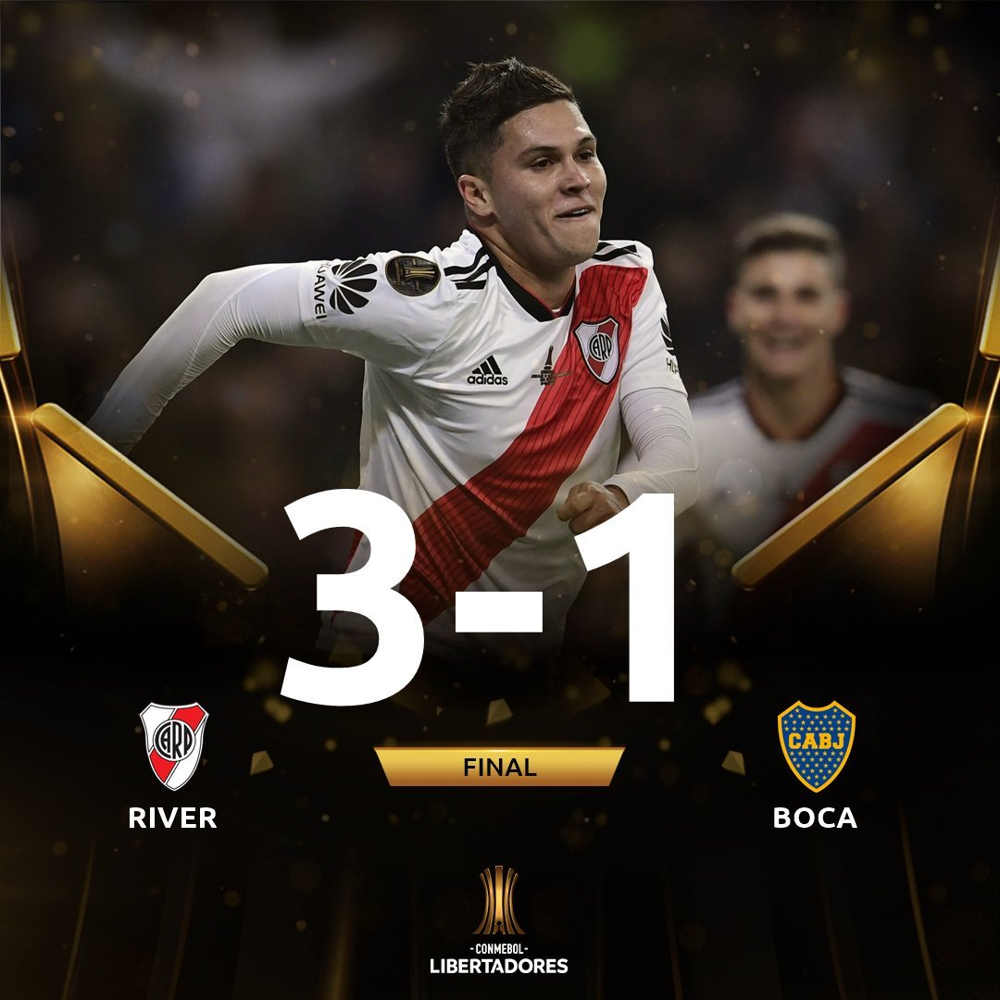
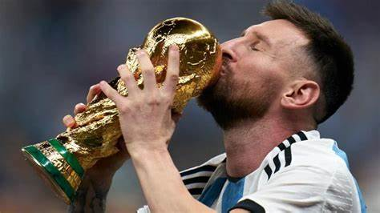

# Que es Futbol

El fútbol es un deporte de equipo jugado entre dos conjuntos de once jugadores cada uno, mientras los árbitros se ocupan de que las normas se cumplan correctamente. Ampliamente considerado el deporte más popular del mundo, lo practican unas 270 millones de personas. El terreno de juego es rectangular, con una portería o arco a cada lado del campo. Se juega mediante una pelota que se debe desplazar a través del campo con cualquier parte del cuerpo que no sean los brazos o las manos, y mayoritariamente con los pies (de ahí su nombre). La Federación Internacional de Fútbol Asociación (FIFA) es el organismo rector del fútbol a nivel mundial.

1. **Posiciones en el campo**:
   - Al inicio de un partido, hay 11 jugadores en cada equipo. Las posiciones pueden variar, pero generalmente hay:
     - **Defensores**: Tratan de evitar que el otro equipo anote goles. Realizan buenos pases de despeje y son físicamente más grandes.
     - **Mediocampistas**: Corren mucho y combinan defensa y ataque. Disponen los ataques y mantienen la posesión del balón.
     - **Delanteros**: Tienen oportunidades de realizar tiros al arco. Son rápidos y ágiles.
     - **Portero**: Protege la portería y es el único que puede usar las manos dentro de su área de penal.

# Historia

La historia del fútbol se considera a partir de 1869, año de fundación de la Asociación Inglesa de Fútbol, aunque en sus orígenes, al igual que los demás códigos de fútbol, se remontan varios siglos en el pasado, particularmente en las islas británicas durante la Edad Media. A continuación, te proporciono un resumen de los antecedentes y desarrollo del fútbol:

1. **Juegos antiguos**:
   - La actividad más antigua de la que se ha derivado el fútbol o algún otro código del cual se tenga conocimiento data de los siglos III y II a. C.
   - En la antigua China, existía un juego llamado ts'uh Kúh (también conocido como tsu chu o luju), que consistía en lanzar una pelota con los pies hacia una pequeña red de diferentes materiales. También había una variante donde los jugadores debían sortear el ataque de sus rivales.
   - En el Lejano Oriente, unos cinco o seis siglos después, existió una variante japonesa llamada kemari, que tenía un carácter más ceremonial. El objetivo era mantener una pelota en el aire pasándosela entre los jugadores.

2. **Formación definitiva del fútbol**:
   - Durante el siglo XIX, representantes de diferentes colegios ingleses se reunieron en la Universidad de Cambridge en 1848 para crear el código Cambridge. Este código sirvió como base para la creación del reglamento del fútbol moderno.
   - Finalmente, en 1863, en la ciudad de Londres, se oficializaron las primeras reglas del fútbol.
   - Desde entonces, el fútbol ha experimentado un crecimiento constante hasta convertirse en el deporte más popular del mundo, con unas 270 millones de personas involucradas diariamente. Actualmente, hay más de 4.000 millones de aficionados al fútbol en todo el mundo.
   - La realización de la primera reunión de la International Football Association Board en 1886 y la fundación de la FIFA en 1904 contribuyeron a la expansión global del fútbol. A partir de 1930, se comenzó a disputar la Copa Mundial de Fútbol, que se ha convertido en el evento deportivo con mayor audiencia en el mundo.

# Como se gana

Hay distintas formas de ganar en el futbol: 

1. - **Marcando más goles**: Esta es la forma más directa y común de ganar en el fútbol. Si un equipo logra anotar más goles que su oponente durante el transcurso del partido, gana el encuentro.

2. - **Tiros desde el punto penal**: En algunas competiciones, si el partido termina empatado al final del tiempo reglamentario, se puede recurrir a una tanda de penales para determinar al ganador. El equipo que convierta más penales gana.

3. - **Prórroga**: En algunas ocasiones, cuando un partido termina empatado al final del tiempo reglamentario, se juega una prórroga de 30 minutos dividida en dos tiempos de 15 minutos cada uno. Si un equipo marca más goles durante la prórroga, gana el partido.

4. - **Gol de oro**: Anteriormente, se utilizaba la regla del gol de oro en la prórroga, lo que significaba que el primer equipo en marcar durante este tiempo ganaba automáticamente el partido. Sin embargo, esta regla ha sido abolida en la mayoría de las competiciones.

5. - **Gol de visitante**: En algunos torneos de eliminatorias, el gol marcado como visitante puede tener un valor extra en caso de empate en el marcador global. Esto significa que si dos equipos están empatados en goles al final de una eliminatoria de ida y vuelta, el equipo que haya marcado más goles como visitante avanza a la siguiente ronda.

6. - **Desempate por diferencia de goles**: En algunas ligas o torneos, si dos o más equipos tienen la misma cantidad de puntos al final de la temporada, el desempate se realiza teniendo en cuenta la diferencia de goles (diferencia entre goles a favor y goles en contra) a lo largo de todos los partidos jugados.

7. - **Desempate por enfrentamientos directos**: En caso de empate en puntos y diferencia de goles, se puede recurrir a los resultados entre los equipos empatados para determinar al ganador. El equipo que haya tenido un mejor desempeño en los enfrentamientos directos avanza.

# Campeonatos

- **Copa Mundial de la FIFA**: El torneo internacional más prestigioso a nivel de selecciones nacionales, celebrado cada cuatro años.

- **UEFA Champions League**: La principal competición de clubes de fútbol en Europa, organizada por la UEFA y disputada anualmente por los mejores equipos del continente.

- **Copa Libertadores**: El torneo más importante de clubes en América del Sur, organizado por la CONMEBOL y disputado anualmente por los mejores equipos de América del Sur y, desde 2020, también por equipos de otras confederaciones.

- **Copa América**: El torneo de selecciones nacionales más importante en América del Sur, organizado por la CONMEBOL y celebrado cada cuatro años.

- **Copa de la UEFA / UEFA Europa League**: La segunda competición de clubes más importante en Europa, organizada por la UEFA y disputada anualmente por equipos de toda Europa que no se clasifican para la Champions League.

- **Premier League**: La liga de fútbol profesional de mayor nivel en Inglaterra, disputada anualmente por 20 equipos.

- **La Liga**: La principal liga de fútbol profesional en España, disputada anualmente por 20 equipos.

- **Serie A**: La máxima categoría del sistema de ligas de fútbol de Italia, disputada anualmente por 20 equipos.

- **Bundesliga**: La máxima categoría del sistema de ligas de fútbol de Alemania, disputada anualmente por 18 equipos.

- **Ligue 1**: La máxima categoría del sistema de ligas de fútbol de Francia, disputada anualmente por 20 equipos.

## Redes de futbolistas

1. [Lionel Messi](https://www.instagram.com/leomessi/)
2. [Cristiano Ronaldo](https://www.instagram.com/cristiano/)
3. [Neymar jr](https://www.instagram.com/neymarjr/)
4. [Julian Alvarez](https://www.instagram.com/juliaanalvarez/)
5. [Enzo Fernandez](https://www.instagram.com/enzojfernandez/)
